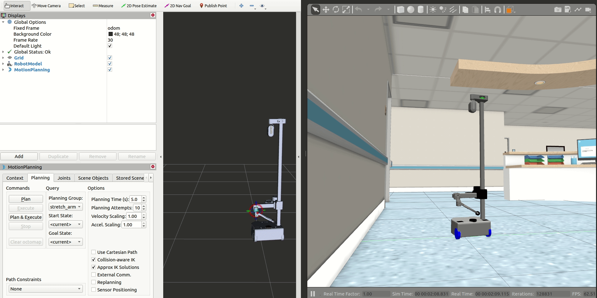
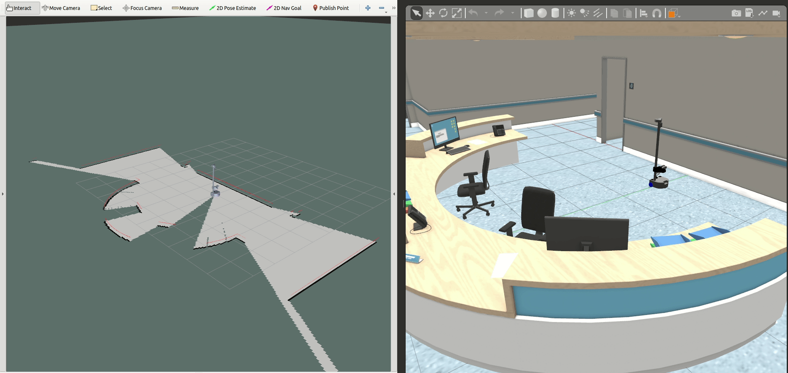
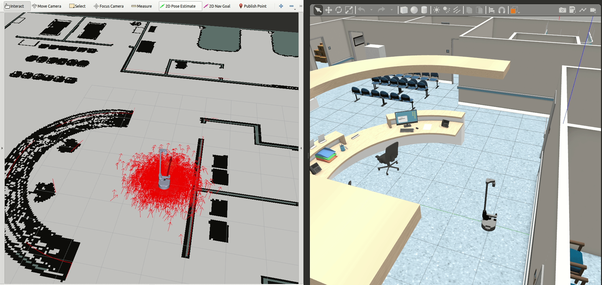
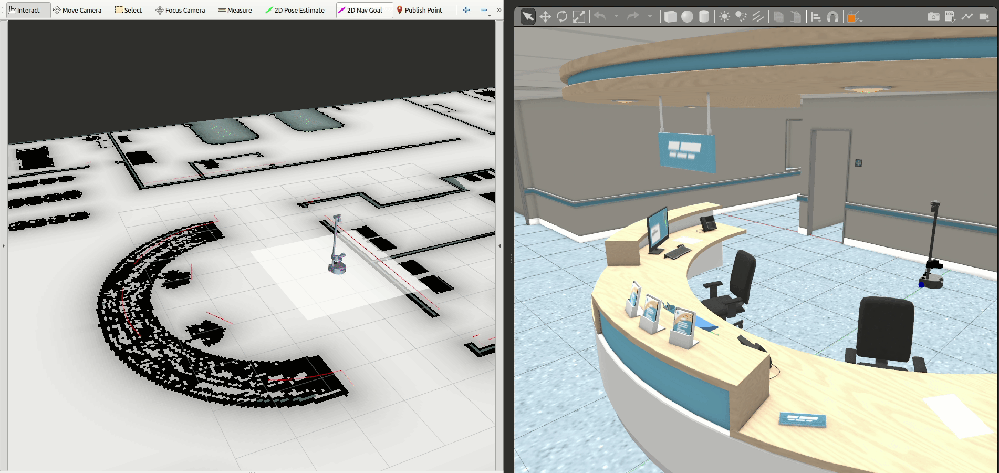

# CUCR Lab Demos (Stretch2). How to Use:

These packages can be installed through [cucr-env](https://github.com/CardiffUniversityComputationalRobotics/tue-env).

Before installing any new package, update your installed packages:

```bash
cucr-get update
```

## Simulation tests

### 0. Installing (checking out) Stretch2 simulation tests

To install (check out) the Stretch2 tests in simulation:

```bash
cucr-get install ros-test_stretch2_simulation_bringup
```

To build the new packages in either case:

```bash
cucr-make
```

### 1. MoveIt! tests:

To test the basic MoveIt! functionalities with Stretch2:

To start the Stretch2 in simulation (Gazebo and rviz):

```bash
test-stretch2-simulation-full moveit:=true
```

> Note: To disable rviz: 'test-Stretch2-simulation-full moveit:=true rviz:=false'

Once the simulation is running, check and activate the `MotionPlanning` display at the left of RViz. Use the visuals from RViz to move the arm to a desired position as below:



Afterwards use the `Plan` and `Execute` buttons to move the Stretch2 arm.

### 2. Mapping tests:

To test the basic `gmapping` functionalities with Stretch2, you should in separate terminals:

To start the Stretch2 in simulation (Gazebo and rviz):

```bash
test-stretch2-simulation-full mapping:=true
```

> Note: To disable rviz: 'test-stretch2-simulation-full mapping:=true rviz:=false'

To teleoperate and move the base:

```bash
test-stretch2-common-base-teleop
```

Start moving the robot around using this terminal and the map will start appearing in the RViz window.



Once all the mapping procedure is finished or it is desired to save the map, open a new terminal in a specific directory and run the following command without closing the simulation:

```bash
rosrun map_server map_saver -f {map_name}
```

> Note: `{map_name}` should be replaced. This will save two files, a `.pgm` and a `.yaml`, both are needed so that the map can be used afterwards.

### 3. Localization tests:

To test the basic `amcl` functionalities with Stretch2, you should in separate terminals:

To start the Stretch2 in simulation (Gazebo and rviz):

```bash
test-stretch2-simulation-full localization:=true x_pose:=1 y_pose:=1
```

> Note: To really test localization, spawn the robot in different locations by changing `x_pose` and `y_pose` parameters. To provide a custom map include the `map_file:={map_file_location}` parameter.

To teleoperate and move the base:

```bash
test-stretch2-common-base-teleop
```

Once the simulation is running completely, use the `2D Pose Estimate` tool located in the upper part of RViz and mark the estimated position of the robot with reference of the gazebo simulation.



Then start moving the robot around using the teleop window, eventually you will see the red particles around the robot converging to a single point in RViz meaning it has localized successfully.

### 4. Navigation tests:

To test the basic `move_base` functionalities with Stretch2, you should in separate terminals:

To start the Stretch2 in simulation (Gazebo and rviz):

```bash
test-stretch2-simulation-full moveit:=true localization:=true navigation:=true
```

> Note: For navigation, localization is required. To provide a custom map include the `map_file:={map_file_location}` parameter.

Use the `2D Nav Goal` tool in the upper side of RViz and set a goal for the robot, it should start moving towards the goal. It is also possible to localize the robot simply by defining goals but closing the teleop window is needed.



## Real-world tests

### 0. Installing (checking out) Stretch2 real-world tests

To install (check out) the Stretch2 tests in simulation:

```bash
cucr-get install ros-test_stretch2_hardware_bringup
```

To build the new packages in either case:

```bash
cucr-make
```

### 1. Connect to the robot

To control the Stretch2 robot and retrieve its sensor data, first you must connect to the robot using WiFi. For that follow the instructions below:

1. Robots Computer (Master)
   1. Position the robot in an open space with at least having 1 meter of separation with any object.
   2. Power the robot ON using the switch located next to the USB dongle.
   3. Connect directly to the robot computer using ssh:
      ```bash
      ssh hello-robot@10.2.91.165 # password: "hello2020"
      ```
   4. Initiate the ROS side of the robot
      ```bash
      roslaunch cucr_stretch2 full.launch
      ```
2. Personal computer (Client)

   Create a communication between the robot and your laptop. To do so, modify the `.bashrc` like this:

   1. Open a new terminal an run this commands:
      ```bash
      cd
      nano .bashrc
      ```
   2. Go to the end of the file and add the following two lines:
      ```
      export ROS_IP=YOUR_IP_ADDRESS
      export ROS_MASTER_URI=http://10.2.91.165:11311
      ```
      > Note: change `YOUR_IP_ADDRESS` for your IP address. You can find your address by writing into terminal: `hostname -I`

**The following tests are under the assumption that you are already connected to Stretch2 robot**

### 2. Mapping test

To test the basic `gmapping` functionalities with Stretch2 hardware, run this command from your computer:

```
test-stretch2-hardware-full mapping:=true
```

Within this launch file it will directly initiate `gmapping` and the keyboard functionalities to command the robot.

To teleoperate and move the base:

```
test-stretch2-common-base-teleop twist_topic:=/stretch/cmd_vel
```

In order to save the map created go into the directory in which you want to save it and run the following command:

```
rosrun map_server map_saver -f {map_name}
```

### 3. Localization test

To test the basic `amcl` functionalities with Stretch2 hardware, run this command from your computer:

```
test-stretch2-hardware-full localization:=true map_file:{map_file_location}
```

To teleoperate and move the base:

```
test-stretch2-common-base-teleop twist_topic:=/stretch/cmd_vel
```

### 4. Navigation test

To test the basic `move_base` functionalities with Stretch2 hardware, run this command from your computer:

```
test-stretch2-hardware-full localization:=true navigation:=true map_file:{map_file_location}
```

> Note: For navigation, localization is required. `DWAPlanner` is used with `move_base`. To provide a custom map include the `map_file:={map_file_location}` parameter.

Use the `2D Nav Goal` tool in the upper side of RViz and set a goal for the robot, it should start moving towards the goal.
